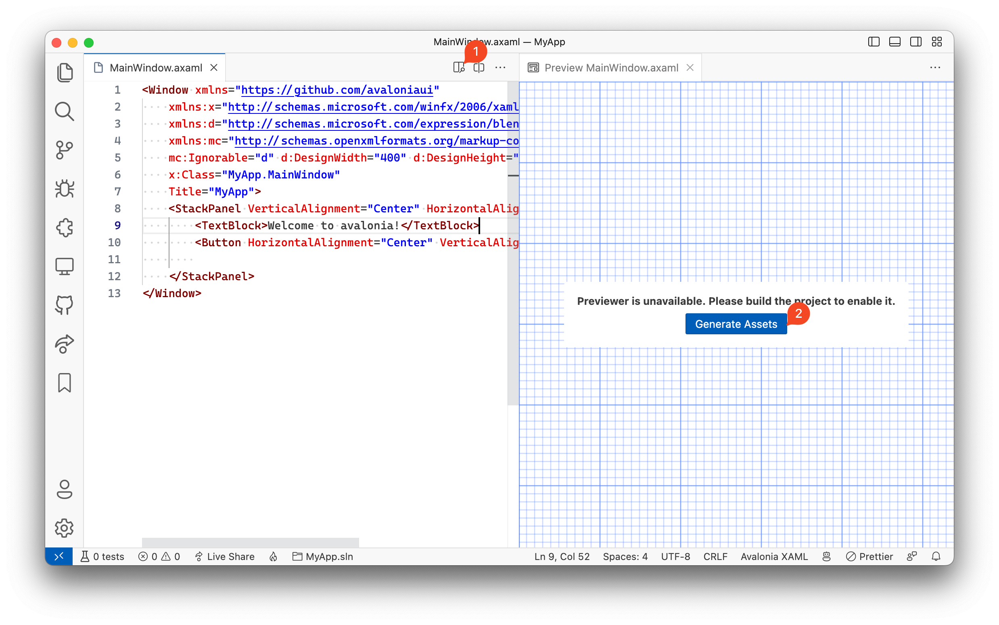
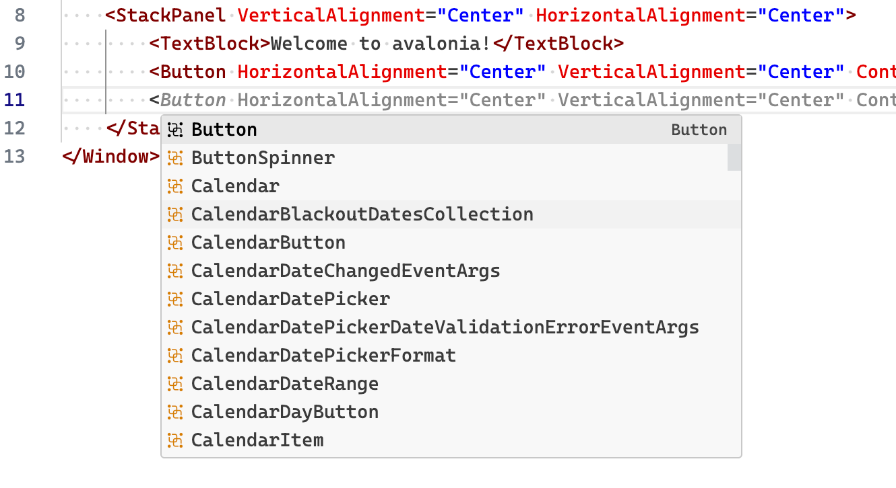

# Avalonia for Visual Studio Code

Avalonia is a cross-platform XAML-based UI framework providing a flexible styling system and supporting a wide range of Operating Systems such as Windows via .NET Framework and .NET Core, Linux via Xorg and macOS.

The Avalonia for Visual Studio Code Extension contains support for Avalonia XAML autocomplete and previewer.

Follow the [contribution guide](CONTRIBUTION.md) if you want to help us build the extension

## Getting Started

### Create a new Avalonia project

You need to create a new Avalonia project from the command line, the extension does not have a way to create a new project from the VS Code yet.

You can create a new Avalonia application by running the following command:

    $ dotnet new avalonia.app -o MyApp

This will create a new folder called `MyApp` with your application files. You can install Avalonia project templates with following command, if you do not have them installed already:

    $ dotnet new install Avalonia.Templates

Finally open the MyApp folder in the VS Code, open any axaml file to activate the extension and code completion.

> NOTE: You must build the project to enable code completion for now.

### Enable Previewer

After you load the project in the VS Code, you can click on Show Preview button on the editor toolbar (1)

The previewer requires that your project is built, and has required metadata. When you open the project for the first time, or clean the project. Click on Generate Assets button (2), and wait for a couple of seconds to preview the XAML file.

The previewer will refresh when you switch between multiple xaml files, unlike Visual Studio for Windows or Rider, VS Code will reuse the single preview window.

### XAML Code completion

The Avalonia XAML in the VS Code is powered by the same code completion engine available for Visual Studio on Windows.

Rich syntax highlighter and contextual code complete will make it lot easier to read and write XAML files

## Limitation/Known Issues

1. Extension may not work if there are multiple `csprojs` in the workspace folder. Make sure to load just the single Avalonia project in the workspace for now.
2. You must build the project to activate the code-completion
3. Previewer may take up to 10 seconds to activate for the first time if you’re using Avalonia `v0.10.*`
4. Code completion may not work/fail on large or complicated xaml files
5. Code completion is slow to show list of items
6. Carrot will not reset between quotes when you add property in the `xaml` file
